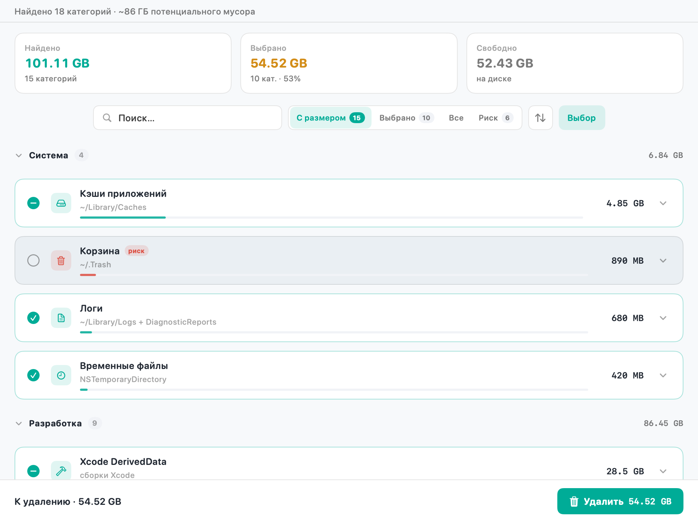
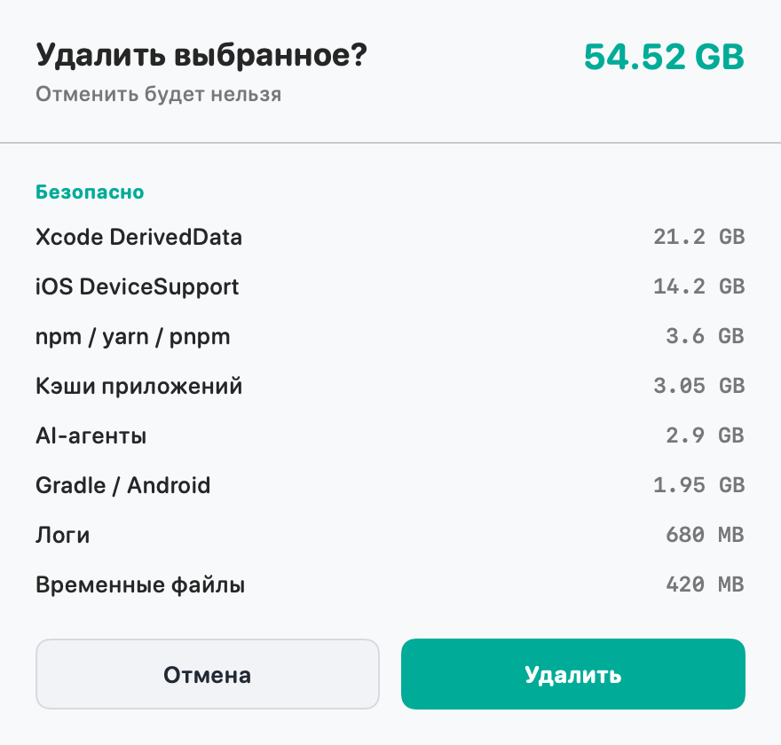

# System Data Cleaner

**English** · [Русский](README.ru.md)

Free up the mysterious **System Data** blob on your Mac.

When About This Mac → Storage shows tens of gigabytes of “System Data”, it’s usually caches, Xcode leftovers, browser junk, Docker layers, and hidden Library folders — not the OS itself. **System Data Cleaner** finds that clutter, shows clear sizes, and deletes only what you select.

The app UI follows your **macOS system language** (English / Russian).



## Download for Mac

[](https://github.com/An11y/SystemDataCleaner/releases/latest)

1. Grab the latest **[Release](https://github.com/An11y/SystemDataCleaner/releases/latest)**
2. Download **`System-Data-Cleaner-*-macOS.dmg`** (or `.zip`)
3. Open the DMG and drag **System Data Cleaner** into **Applications**  
   (from ZIP: unzip, then drag the `.app` the same way)
4. First launch: **right‑click → Open** (Gatekeeper; ad‑hoc signed build)
5. Optionally grant **Full Disk Access** (below) for deeper scans

Universal binary: Apple Silicon + Intel · macOS 14+

## Familiar problem, clear fix

You’ve seen it before:

- Storage almost full, but you can’t find what’s eating space  
- “System Data” keeps growing after Xcode, Docker, browsers, or AI tools  
- You don’t want a black‑box cleaner that wipes things without asking  

System Data Cleaner is built for that moment: scan → review → confirm → reclaim space.

Typical finds:

- App & browser caches  
- Xcode DerivedData / DeviceSupport / simulators  
- Docker, npm, pip, Gradle and other dev caches  
- Group Containers, sandbox caches, old crash reports  
- Project leftovers (`node_modules`, `.next`, `target`, …)

Nothing is removed until you check it and confirm.

## Features

| Feature | What you get |
|---|---|
| **110+ categories** | System · Developer · Apps · Hidden |
| **Smart Clean** | Safe + large “caution” items, skips dangerous ones (⌘⇧2) |
| **Live scan** | Results appear as they’re found · 8 workers · size cache |
| **Subfolders** | Toggle individual folders/files inside a category |
| **Risk labels** | Safe / caution / risk · grouped confirm dialog |
| **System theme** | Follows macOS light & dark appearance |
| **Full Disk Access** | Clear prompt when deeper paths need permission |

Risky categories (Trash, backups, Archives, Document Revisions, etc.) stay **off by default**. Always double‑check items marked **risk**.

## Full Disk Access

**System Settings → Privacy & Security → Full Disk Access** → add *System Data Cleaner*.

Without it, Mail, Messages, and many Containers may look empty.

## How to use

1. **Scan** (⌘R) — discover junk  
2. **Smart** (⌘⇧2) — pick a safe selection, or choose manually  
3. **Delete** (⌘⌫) — confirm in the dialog  

Also: ⌘F search · ⌘⇧1 safe only · ⌘⇧0 deselect all · Esc collapse details.

## Screenshots

| Main window | Confirm |
|---|---|
|  |  |

## Build from source

```bash
git clone https://github.com/An11y/SystemDataCleaner.git
cd SystemDataCleaner
./build_app.sh
```

Installs to **`/Applications/System Data Cleaner.app`**.

```bash
open -a "System Data Cleaner"

./build_app.sh --no-install   # local .app only
./build_app.sh --package      # ZIP + DMG in dist/
```

### Project layout

```
SystemDataCleaner/
├── SystemDataCleanerApp.swift
├── ContentView.swift
├── CleanerViewModel.swift
├── CleanerEngine.swift
├── Models.swift
├── Theme.swift
└── Info.plist
scripts/generate_icon.swift
scripts/capture_window.swift
build_app.sh
```

```
scanAll → onPartial (live UI) → select → confirm → clean → rescan + free disk
```

## Requirements

- macOS 14+ (Apple Silicon and Intel)
- To build: Swift 5.9+ (Command Line Tools / Xcode)

## License

[MIT](LICENSE)

Provided as‑is. Deletion is permanent — review **risk** categories before you clean.
